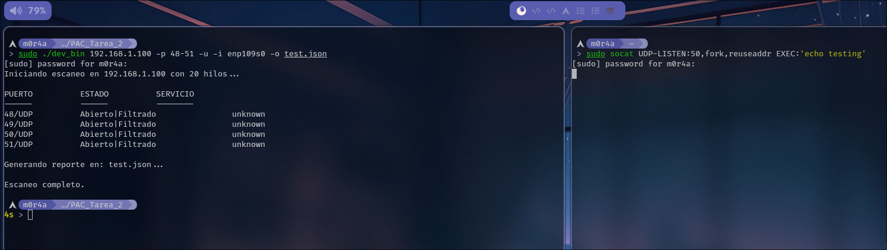
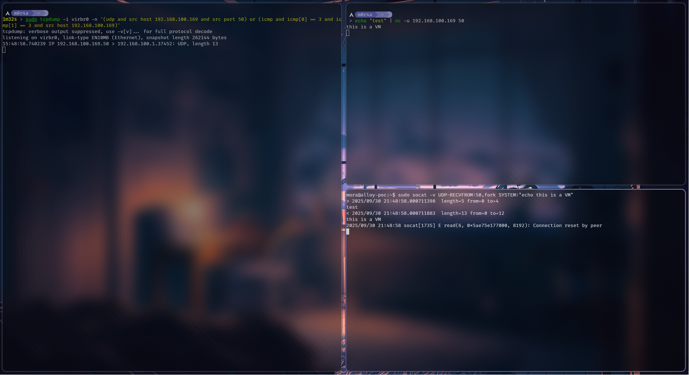
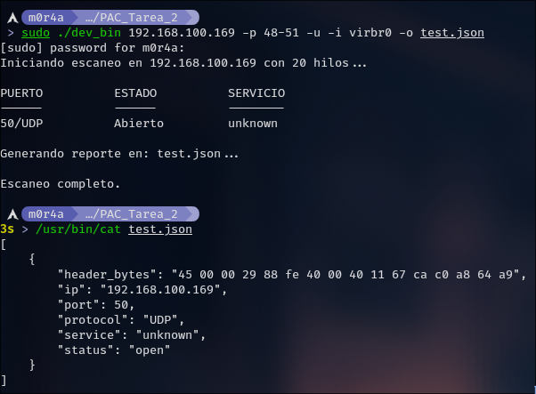

# Escáner híbrido de puertos y sniffing en C++ con informe JSON

## Descripción general
Herramienta en C++ para Linux que combina escaneo real de puertos TCP/UDP y captura de la primera trama de respuesta. Al finalizar, genera un informe JSON con servicios y primeros bytes de cabecera.

## Requisitos
- **Sistema operativo**: Linux (testeado en Arch Linux)
- **Compilador**: g++ (C++23)
- **Dependencias**: libpcap

Instalación de dependencias:
```bash
sudo apt-get install libpcap-dev
```

## Compilación
```bash
make
```

O manualmente:
```bash
g++ -std=c++23 -Wall -Wextra -O2 -Isrc/include \
    src/main.cpp src/escaneo.cpp src/sniffer.cpp src/args.cpp src/JSONGen.cpp \
    -o escaner -lpcap -pthread
```

## Ejecución

```bash
sudo ./escaner <IP> [opciones]
```

**Opciones disponibles:**
- `-p, --ports <rango>`: Puertos a escanear (ej: `20-80` o `22,80,443`)
- `-u, --udp`: Escanear UDP
- `-tu, -ut`: Escanear TCP y UDP
- `-i, --interface <if>`: Interfaz de red (ej: `enp109s0`, `lo`)
- `-o, --output <file>`: Archivo JSON de salida
- `-t, --threads <n>`: Número de hilos
- `--timeout <ms>`: Timeout en milisegundos

> No es el mejor diseño del mundo pero por defecto usa TCP

**Ejemplos:**
```bash
# Escaneo TCP básico
sudo ./escaner 192.168.1.100 -p 20-1024 -o resultado.json

# Escaneo UDP en puerto DNS
sudo ./escaner 8.8.8.8 -p 53 -u -i enp109s0

# Escaneo local (importante usar interfaz lo)
sudo ./escaner 127.0.0.1 -p 1-1000 -u -i lo
```

**Test:**
```bash
make test
```

Alternativamente make viene con un pequeño test

## Enfoque técnico

**Escaneo TCP:**
- Conexiones no bloqueantes con `select()`
- Captura de flags TCP (SYN-ACK, RST) con libpcap
- Prioriza resultado del sniffer sobre `connect()` para mayor precisión

**Escaneo UDP:**
- `sendto()` para envío de probes
- Captura de respuestas UDP o mensajes ICMP Port Unreachable
- Timeout 2x mayor que TCP por latencia de red

**Sniffing:**
- libpcap con filtro BPF para IP/puertos específicos
- Captura del primer paquete de respuesta
- Extracción de primeros 16 bytes del header IP

**Concurrencia:**
- Thread pool con patrón productor-consumidor
- Sincronización con `std::mutex` y `std::promise/std::future`
- `std::atomic` para prevenir race conditions en callbacks de pcap

**JSON:**
- `nlohmann/json` para serializar resultados

## JSON generado
```json
[
    {
        "header_bytes": "45 00 00 22 0d 62 40 00 40 11 2f 67 7f 00 00 01",
        "ip": "127.0.0.1",
        "port": 50,
        "protocol": "UDP",
        "service": "test-port",
        "status": "open"
    }
]
```

## Limitaciones conocidas

### Escaneo local con interfaz física (UDP)

Al escanear tu propia IP en una interfaz no-loopback, UDP siempre reporta `open|filtered`:

```bash
# No funciona bien
sudo ./escaner 192.168.1.50 -p 50 -u -i enp109s0  # Si 192.168.1.50 es tu IP
```

<p align="center">
    
</p>

**Causa**: El kernel Linux optimiza el tráfico local y no envía paquetes por la interfaz física. El sniffer nunca captura la respuesta porque los paquetes no pasan realmente por `enp109s0`.

**Solución**: Para escaneo local, **siempre usar interfaz loopback**:
```bash
sudo ./escaner 127.0.0.1 -p 50 -u -i lo
```

Sin embargo el escaneo **SÍ funciona** para interfaces ethernet cuando escaneas otra máquina real. Ejemplo con una máquina virtual:

De forma manual se muestra que sí se recibe el paquete:
<p align="center">
    
</p>

Y el escaneo exitoso:
<p align="center">
    
</p>

**¿Por qué TCP sí funciona con auto-escaneo?**

TCP usa `connect()` como fallback cuando el sniffer no captura nada. El kernel internamente sabe si el puerto está abierto/cerrado sin necesidad de que los paquetes pasen por la interfaz física. UDP no tiene este fallback porque es stateless.

## Notas de desarrollo

### Comandos útiles para testing

Abrir un puerto UDP que responda:
```bash
sudo socat UDP-LISTEN:50,fork,reuseaddr EXEC:'echo hello'
```

Validar captura con tcpdump:
```bash
sudo tcpdump -i lo -n '(udp and src host 127.0.0.1 and src port 50) or (icmp and icmp[0] == 3 and icmp[1] == 3 and src host 127.0.0.1)'
```

### Header bytes

Los primeros 16 bytes capturados corresponden al header IP de la respuesta. Ejemplo:

```bash
sudo socat UDP-LISTEN:50,fork,reuseaddr EXEC:'echo hello'
```
Output: `45 00 00 22 0d 62 40 00 40 11...`

El offset correcto salta la capa de enlace (14 bytes para Ethernet, 4 para Loopback) y captura desde el header IP.

> [!NOTE]
> Nota final, tómese como documentación también todos los comentarios del código, me tomó como 3 horas.
